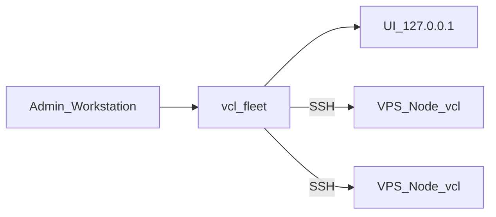

# Vincula（VCL）

面向自有 Debian/Ubuntu VPS 的最小化 **sing-box** 部署与内部流量审计。

**节点** `VINCULA_VERSION=0.5.0`（CLI：`vcl` / `vincula`）· **控制器** `VCL_FLEET_VERSION=0.5.0`（CLI：`vcl-fleet`）。

协议固定：VLESS + REALITY + xtls-rprx-vision + TCP；sing-box **1.13.18**（不追 latest）。流量统计为 **approximate / Clash polling**，非计费级。

---

## 解决什么问题

在你自己的 VPS 上快速装好固定协议栈，用工作站上的 Fleet 控制器统一登记节点、开通同一逻辑用户、同步审计，并在本机只读 UI 里观察健康与流量。

## 适用场景

- 少量自管 VPS（Debian 12/13，Ubuntu 22.04/24.04/26.04；amd64/arm64）
- 需要多用户 tag、轮换凭据、换机保留 `node_id`
- 管理员工作站可为 Windows 11 或 Linux（Python 3.10+ + 系统 OpenSSH）

## 核心能力

- Fresh **provision** / 已装 **adopt** / 离线 **register**
- Fleet 全局 `user_id`、按节点 credential、PARTIAL 语义
- Local Audit UI（localhost 只读）+ Command Builder（只复制命令）
- Secretless backup / restore / **node replace**（runtime-only 新机）
- Legacy single-user seed（保留旧客户端 URI，严格受限）

## 明确不做什么

- 公网管理 API / 公网 Web 面板
- UI 内执行高危变更
- 多协议或通用 Xray 配置导入
- 计费级精确流量
- 多用户「整站」legacy 迁移

---

## 架构（简图）



数据面：客户端直连各 Node（默认 TCP 443）。控制面：仅工作站 → Node 的 SSH。

---

## 当前版本与兼容性

| 项目 | 值 |
| --- | --- |
| Controller | **0.4.5** |
| 新 provision Node | **0.3.2** |
| 最低兼容 Node | **0.3.1** |
| OS | Debian 12/13；Ubuntu 22.04/24.04/26.04 |
| Arch | amd64、arm64 |
| Clash API | 仅 `127.0.0.1`（默认 9090 + secret） |
| UI | 仅 loopback（默认 `127.0.0.1:8765`） |

完整兼容表与合同：[`docs/technical-guide.md`](docs/technical-guide.md)。Gate：[`docs/release-readiness-0.3.1.md`](docs/release-readiness-0.3.1.md) · [`docs/known-issues-0.3.1.md`](docs/known-issues-0.3.1.md) · [`docs/evidence/0.4.5/SUMMARY.md`](docs/evidence/0.4.5/SUMMARY.md)。

---

## Quick Start（推荐：Controller 管 VPS）

1. 获取并校验 `vincula-controller-*.zip`（`sha256sum -c` sidecar 与解压后的 `controller.lock`）。
2. 安装 Python 3.10+ 与系统 OpenSSH。
3. 初始化并绑定 SSH 身份：

```bash
python3 bin/vcl-fleet init
python3 bin/vcl-fleet access bind admin --identity-file ~/.ssh/id_ed25519
```

4. 空 VPS 安装并登记：

```bash
python3 bin/vcl-fleet node provision myvps \
  --host HOST \
  --host-key 'SHA256:…' \
  --server ADVERTISED_HOST
```

5. 开通用户并同步：

```bash
python3 bin/vcl-fleet user add alice --nodes myvps
python3 bin/vcl-fleet sync --full
python3 bin/vcl-fleet status
python3 bin/vcl-fleet ui
```

6. 取链（敏感）：`python3 bin/vcl-fleet user link alice --node myvps`

Windows 使用 `bin\vcl-fleet.cmd`。逐步说明：[`docs/user-guide.md`](docs/user-guide.md)。

> 从源码打 `vincula-node-*.tar.gz` / controller zip 属于维护者路径，见下方「开发与测试」，**不是**新用户第一条安装路径。

---

## provision / adopt / register

| 方式 | 何时用 |
| --- | --- |
| `node provision` | 空 VPS：远端安装 + verify + 注册 |
| `node adopt` | 已装 Vincula：SSH 读 identity 后注册 |
| `node register` / `add --offline` | 无 SSH 先写 registry；之后仍须验证 |

---

## 常用管理入口

| 任务 | 命令入口 |
| --- | --- |
| 节点列表 / 健康 | `vcl-fleet node list` · `status` · `probe` · `verify` |
| 用户 | `vcl-fleet user add\|link\|rotate\|disable`（后三者需 `--node`） |
| 同步 | `vcl-fleet sync` / `sync --full` |
| 换机 | `vcl-fleet node replace`（见 [`docs/operations/node-replace-runbook.md`](docs/operations/node-replace-runbook.md)） |
| 节点本机 | `sudo vcl user\|stats\|audit\|backup\|verify` |

参数以 `--help` 为准。

---

## WebUI

`vcl-fleet ui` 打开本机只读 Local Audit UI（Overview / Nodes / Users / Traffic / Operations / Audit 等）。Command Builder 只生成可复制命令，**不执行**变更。非 loopback 绑定会被拒绝。

---

## 安全边界

- 无公网管理端口；Clash API 与 UI 仅本机。
- 打印 VLESS URI 的命令按密钥处理。
- 生产 bootstrap 须固定 `RELEASE_SHA256`（仅校验「同 URL 旁路 digest」只能发现传输损坏，不能防来源双文件同时替换）。

---

## 文档

| 文档 | 受众 |
| --- | --- |
| [`docs/README.md`](docs/README.md) | 导航 |
| [`docs/user-guide.md`](docs/user-guide.md) | 日常管理员 |
| [`docs/technical-guide.md`](docs/technical-guide.md) | 维护者 / 实现合同 |
| [`CHANGELOG.md`](CHANGELOG.md) | 版本历史 |
| [`docs/evidence/`](docs/evidence/README.md) | 验收证据 |
| [`docs/specs/`](docs/specs/README.md) | 设计规格 |

历史冻结材料：[`docs/legacy/`](docs/legacy/README.md)（不得当作当前操作手册）。

---

## 开发与测试

```bash
bash tests/test.sh
bash scripts/gen-release-lock.sh
bash scripts/build-release.sh      # → dist/vincula-node-<version>.tar.gz
bash scripts/build-controller.sh   # → dist/vincula-controller-<version>.zip
```

Merge gate：[`.github/workflows/ci.yml`](.github/workflows/ci.yml)。源码以仓库根目录为准；不要手改 `dist/`。
