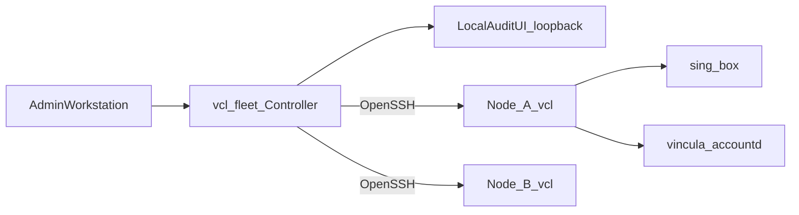
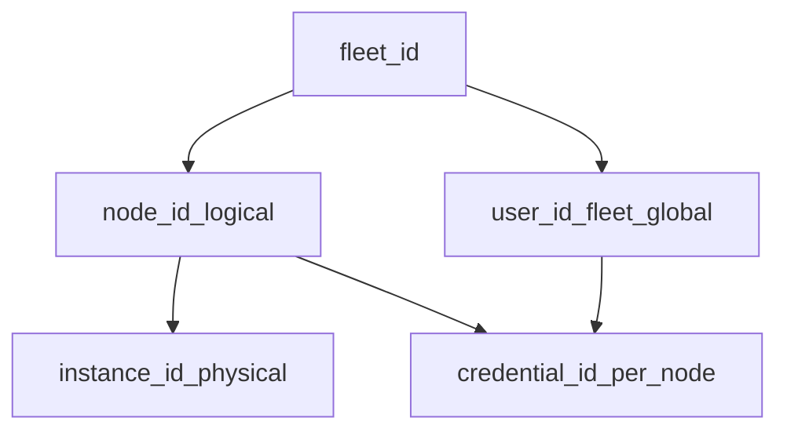
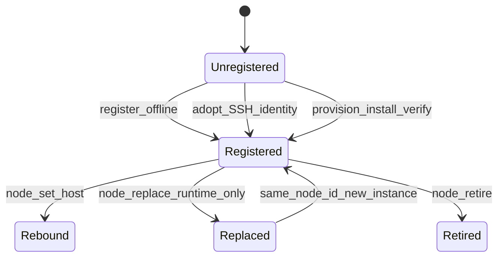
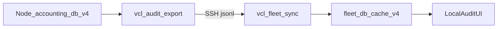

# Vincula 技术手册（Controller 0.4.5 · Node 0.3.2）

面向维护者与希望理解实现合同的读者。操作步骤见 [`user-guide.md`](user-guide.md)。
设计规格见 [`specs/`](specs/README.md)；验收证据见 [`evidence/`](evidence/README.md)。

**版本权威（代码）：**

| 常量 | 位置 | 值 |
| --- | --- | --- |
| `VCL_FLEET_VERSION` | `lib/vincula-fleet.py` | **0.4.5** |
| `VINCULA_VERSION` | `vincula.sh` | **0.3.2** |
| 新 provision payload pin | Controller | Node **0.3.2** |
| 最低兼容 Node | Spec / fleet | **0.3.1**（已有 0.3.1 不强制升级） |

---

## 1. 系统目标与设计原则

Vincula（VCL）面向自有 Debian/Ubuntu VPS：固定 **VLESS + REALITY + xtls-rprx-vision + TCP**，固定 sing-box **1.13.18**，提供节点安装、多用户生命周期、近似流量审计，以及工作站侧 Fleet 控制器。

设计原则：

- **CLI-first**：变更走节点 `vcl` / 控制器 `vcl-fleet`；WebUI 只读。
- **低攻击面**：无公网管理 API；Clash API 仅 `127.0.0.1`；UI 仅 loopback。
- **星形控制**：Controller → 各 Node 经系统 OpenSSH；Node 之间无对等控制。
- **身份冻结**：`node_id` / `user_id` 逻辑稳定；物理换机走 `instance_id` 与 replace。
- **近似记账**：Clash 轮询，非计费级（见 §11）。

明确不做：多协议代理、公网管理面板、UI 高危 mutation、通用 Xray/sing-box 配置导入、计费级精确计量。

---

## 2. Controller—Node 拓扑



- **Controller**：用户态 Python；无 root、无 systemd、无 `/etc/vincula`。
- **Node**：VPS 上 `vcl` / `vincula` + sing-box + vincula-accountd。
- **数据面**：客户端 → Node:443（或 URI 端口）→ 出站；不经 Controller。

入口：`vcl-fleet`（Unix `bin/vcl-fleet`；Windows `bin/vcl-fleet.cmd`）≡ SPEC 中的 `vcl fleet`。节点 helper **没有** `fleet` 子命令。

---

## 3. 三平面

| 平面 | 职责 | 典型命令 |
| --- | --- | --- |
| **控制平面** | 注册节点、开通用户、replace、retire | `vcl-fleet node|user …`（SSH 变更） |
| **数据平面** | VLESS 流量 | sing-box |
| **本地读平面** | 已 sync 的 `fleet.db` / UI cache | `vcl-fleet status`、`audit`、`stats`、`ui`（无 SSH） |

`probe` / `verify` / 裸 `user list|show|link` 为 **live observation**（SSH，一般不写 status cache）。`sync --full` 写入健康与用户快照。

---

## 4. 组件职责

| 组件 | 职责 |
| --- | --- |
| Controller `vincula-fleet.py` | registry、SSH trust、user 编排、sync、replace、UI 启动 |
| Node installer `vincula.sh` | 安装 / 迁移 / `--runtime-only` / legacy seed |
| Node CLI `bin/vincula`（`vcl`） | user / audit / stats / backup / restore / identity / verify |
| sing-box 1.13.18 | 代理 + Clash API（loopback） |
| vincula-accountd | Clash 轮询 → accounting-db/v4 |
| Local Audit UI `lib/vincula-ui/` | cache-first 只读；Command Builder 仅复制命令（D53） |

---

## 5. 身份模型



| ID | 含义 | 规则 |
| --- | --- | --- |
| `node_id` | 逻辑节点 | 永久 UUID；改名 / 改 IP **不**重铸 |
| `instance_id` | 物理安装 | ≠ `node_id`；SoT = `/etc/vincula/state.json` → `node.instance_id` |
| `user_id` | Fleet 逻辑用户 | 开通时注入同一 UUID；tag 仅 UX |
| `credential_id` / VLESS uuid | 每节点凭据 | rotate 只换本节点；`list`/`show` JSON **不含** VLESS uuid |

`fleet.json` **不**存 `instance_id`。可移植 SoT：`history/instances.jsonl`；`fleet.db` 可物化。

Schema 命名空间（D45）：

| 名称 | 用途 |
| --- | --- |
| accounting-db/v4 | 节点记账 |
| fleet-registry/v2 | `fleet.json` |
| fleet-cache/v4 | `fleet.db` |
| workspace/v1 | `workspace.json` |
| audit-archive/v1 | 审计归档包 |

---

## 6. Portable workspace 与 machine-local binding

| 层级 | 路径（缺省） | 内容 |
| --- | --- | --- |
| Portable root | `VCL_FLEET_HOME` / `--workspace`；Win `%APPDATA%\vincula\`；Unix `~/.config/vincula/` | **仅** `workspace.json` · `fleet.json` · `trust/` · `history/` |
| CONFIG | `…/controllers/<fleet_id>/` | `controller.json` + `credential-bindings.json`（`access bind`） |
| STATE | Unix `~/.local/state/vincula/<fleet_id>/`；Win `%LOCALAPPDATA%\vincula\<fleet_id>\`；可 `VCL_FLEET_LOCAL_STATE` | fleet-cache/v4 `fleet.db`、`archives/`、`ui-runtime/` |

SSH：workspace 激活时用 `trust/known_hosts`（`StrictHostKeyChecking=yes`）。身份文件经 `access bind` 绑定到机器本地，不把私钥写入可拷贝 workspace。

---

## 7. registry、fleet.db、snapshot、journal

| 存储 | 角色 |
| --- | --- |
| `fleet.json` | 节点名、`node_id`、SSH 端点、enabled/status |
| `fleet.db` | audit_events、daily_usage、sync cursor、`user_snapshot`、`node_snapshot`、`instance_history` |
| `sync --full` | identity + health + users + audit → cache |
| 裸 `sync` | 审计增量（`export_seq` / Protocol v2） |
| operation journal | UI / CLI 近期操作（含 PARTIAL）；非分布式事务日志 |

Cursor：`CURSOR_EXPIRED` → `--reseed`；`CURSOR_AHEAD` → 检查时钟 / reseed。错误文案命名空间：`unsupported fleet-cache schema:` / `unsupported fleet-registry schema:`。

---

## 8. SSH trust 与 host-key

- 首次 `adopt` / `provision` / `replace` 须 `--host-key SHA256:…`（写入 known_hosts）。
- `node set`（同实例改 IP）**不**自动改 known_hosts；需再次 pin 或手改。
- 非交互且无 host-key → 失败（D14）。
- 读探测超时约 20s；用户/restore 变更约 60s；远端 backup create 约 120s。

---

## 9. provision / adopt / register / replace



| 操作 | 远端 | 用途 |
| --- | --- | --- |
| `node provision` | 安装 + verify + 注册 + 默认 `sync --full` | 空 VPS；payload pin **0.3.2**；可选 legacy seed |
| `node adopt` | `vcl identity --json` + 注册 | 已装节点 |
| `node register` / `add --offline` | **无 SSH** | 仅写 registry；后续须 adopt/set |
| `node set` | 无（本地改 `ssh_host`） | **Endpoint rebind**；凭据不变 |
| `node replace` | secretless backup → restore | 新物理机；**runtime-only** NEW_HOST |

### replace 合同（测试与运维硬约束）

NEW_HOST 必须已是 **runtime-only**（`sudo bash vincula.sh --runtime-only` 或 `VCL_RUNTIME_ONLY=1`），且 **不得** 有 `$STATE_DIR/VERSION`。

远端 restore argv：

```text
vcl restore FILE --reissue-output FILE --server HOST --json
```

- 使用 `--reissue-output`（不是 restore 的 `--output`）。
- Node `vcl restore` is **fresh-node only**; the controller drives physical replace via `node replace` and remote `--reissue-output` (not a restore-side replace flag).
- 详细检查表：[`operations/node-replace-runbook.md`](operations/node-replace-runbook.md)（B14 LIVE **PASS 2026-08-18**）。

---

## 10. 事务、回滚与 PARTIAL

| 场景 | 语义 |
| --- | --- |
| 节点 install / migrate | `vincula.sh` EXIT trap + rollback；legacy 密钥临时文件在早期 `0700` `$TMP_DIR` |
| `vcl restore` | VERSION 为提交标记；失败回滚 staged 文件与服务状态 |
| Controller `user add` 多节点 | 任一节点失败 → **PARTIAL，exit 2**；无分布式 rollback |
| provision 远端已好、本地 registry 未提交 | `REMOTE_READY_LOCAL_UNCOMMITTED`；用 adopt 修复，勿重跑安装 |

退出码摘要：0 成功；1 一般错误；**2 PARTIAL**；3 `CURSOR_*`（节点 export）；4 busy（锁）；255 SSH 传输层失败。

---

## 11. Audit、accounting、sync 与 approximate 流量

### Status: Approximate — Reliable Accounting is NOT done

记账建立在 stock sing-box **1.13.18** Clash API（`127.0.0.1` only）与 `acct/<tag>` outbound 上。Clash 轮询是 **唯一** 生产采集器；无 file-backed ingest。短连接可能漏计；**不可作发票/计费**。

保留默认：raw **90** 天 / daily **90** 天（UTC）。文档须写 **accounting-db/v4**，不要写裸 “Schema 4”。

| 对象 | 角色 |
| --- | --- |
| `event_id` | 稳定 generation 身份 |
| `export_seq` | Fleet 游标；打开行为 NULL；关闭时一次赋值 |
| `daily_usage` | UTC 日汇总 `(date, user_id, destination_host)` |

控制器：`sync` 导入 closed `export_seq`；`audit` / `stats` 读本地 `fleet.db`。UI Overview 流量亦为 approximate。

---

## 12. Backup / restore / replace 身份保留

### 两种备份

| 模式 | 命令 | 加密 | 内容 |
| --- | --- | --- | --- |
| A. secretless（默认） | `vcl backup create` | 无 | 身份 + audit + accounting；**无** live secrets |
| B. Full DR | `vcl backup create --include-secrets --age-recipient FILE` | **强制 age** | A + Reality 私钥、VLESS uuid、Clash secret |

`vcl-fleet node replace` **仅** secretless。

### Archive（backup schema 1）

成员：`manifest.json`、`state.json`、`users.json`、`config.toml`、`accounting.db`、`VERSION`。归档文件模式 **0600**；`BACKUP_ROOT` `/var/backups/vincula` **0700**。

### Size caps and streaming (P2-02)

| Constant | Default | Applies to |
| --- | --- | --- |
| `MAX_MEMBER_BYTES` | 1 GiB | Each tar member (`accounting.db` is the large one) |
| `MAX_ARCHIVE_BYTES` | 2 GiB | Sum of uncompressed member sizes |
| `MAX_TEXT_MEMBER_BYTES` | 16 MiB | JSON/text members kept in memory |

`BACKUP_SCHEMA_VERSIONS_READ = (1,)`。超限 → `invalid_archive`。

### Restore（fresh node）

- 目标不得已有 `/etc/vincula/VERSION`。
- 默认 secretless：轮换 Reality / Clash / active VLESS；保留 `node_id` / `user_id` / accounting；新 `instance_id`。
- Reissue CSV：`user,node,old_credential_id,new_credential_id,vless_uri`（0600）。

---

## 13. Secret 合同

- 控制器 zip / registry / UI / `user list|show` JSON：**不**含 VLESS URI、私钥、Clash secret。
- `user link` / `add` / `rotate` / credential export：**含**敏感输出；须警告与 0600。
- Legacy seed：URI/私钥仅经本地文件 → SCP path-only → 远端 0600；临时副本在 `$TMP_DIR`，EXIT 清理。
- 日志脱敏：禁止原样打印 URI / Reality 私钥。

---

## 14. 网络与安全边界

| 监听 | 绑定 | 说明 |
| --- | --- | --- |
| VLESS | 公网（默认 443；legacy 可非 443） | 数据面 |
| Clash API | `127.0.0.1:9090` + secret | 禁止 `0.0.0.0` |
| Local Audit UI | `127.0.0.1:8765`（默认） | 拒绝非 loopback（AC-3.1） |

Controller **不**监听管理口。允许 `scp` 备份归档与 reissue CSV；**不要**例行 `scp` 活 `accounting.db`。

---

## 15. WebUI 边界

- cache-first：Overview / Users / Traffic 主要读 `fleet.db` / users-cache。
- 只读：无 CSRF mutation 模型；变更走 CLI。
- Command Builder / Recipes：生成并复制命令，**不执行**（D53）。
- Users 列表：`user_snapshot`（sync）与 refresh cache 合并；勿只信过期 SSH cache。

手测与 UI 合同：[`evidence/0.4.4/SUMMARY.md`](evidence/0.4.4/SUMMARY.md) · [`specs/V0.4.4_ui_v2.md`](specs/V0.4.4_ui_v2.md)。

---

## 16. 版本兼容（权威表）

| Controller | 新 provision Node | 最低兼容 Node | 备注 |
| --- | --- | --- | --- |
| 0.5.0 | 0.5.0 | 0.3.1 | capability/telemetry + **`node upgrade`** 0.3.1+→0.5.0；见 [`specs/V0.5.0_Spec.md`](specs/V0.5.0_Spec.md) · evidence [`evidence/0.5.0/SUMMARY.md`](evidence/0.5.0/SUMMARY.md) |
| 0.4.5 | 0.3.2 | 0.3.1 | Legacy seed 需 0.3.2 |
| 0.4.4 | 0.3.1 | 0.3.1 | UI v2 |
| ≤0.4.3 | 见当时 evidence | — | 历史 |

Node 0.3.1 → 0.3.2 原地升级必须保留：`node_id`、`instance_id`、Reality、用户 UUID、`user_id`/`credential_id`、accounting、已有 URI。

Gate：[`release-readiness-0.3.1.md`](release-readiness-0.3.1.md) · [`known-issues-0.3.1.md`](known-issues-0.3.1.md) · [`evidence/0.4.5/SUMMARY.md`](evidence/0.4.5/SUMMARY.md)。

---

## 17. 测试、构建与 release gate

```bash
bash tests/test.sh              # 含 test-fleet.sh
bash scripts/gen-release-lock.sh
bash scripts/build-release.sh   # → dist/vincula-node-<ver>.tar.gz
bash scripts/build-controller.sh # → dist/vincula-controller-<ver>.zip
```

CI：`.github/workflows/ci.yml`（unit / concurrency / failure-injection / artifact）。
Controller zip 含 `README-controller.md`、`bin/vcl-fleet`、`bin/vcl-fleet.cmd`、`lib/*`、`controller.lock`；旁路 `.sha256`。

### status / probe / verify 与时钟

```text
CLOCK_SKEW_WARN_SECONDS = 30
CLOCK_SKEW_FAIL_SECONDS = 300
CLOCK_SKEW_FAIL_CHECK = "audit-clock-health"
```

- `status`：cache-only（D58）；无 SSH。
- `probe`：live SSH 健康；**不写** status cache。
- `verify`：identity + status + clock；漂移 >30s WARN，>300s FAIL。

### AC-2.9（节选；fixture 权威在 tests）

| ID | Criterion | Fixture evidence pointer |
| --- | --- | --- |
| AC-2.9-01 | Same user, two nodes: one `user_id`, different credential UUIDs | `tests/test-fleet.sh` `AC-2.9-01 user add alice --nodes lax,tokyo` |
| AC-2.9-10 | No VPS management API port; UI is workstation loopback-only in `lib/vincula-ui` | Static grep: no `socket.bind` / `HTTPServer` in `lib/vincula-fleet.py`, `bin/vcl-fleet`, `bin/vcl-fleet.cmd`; UI refuses non-loopback |

完整 AC-2.9-01…12、AC-3.0、AC-3.1 见历史 [`fleet.md` 合并前矩阵](evidence/0.3.1-final/SUMMARY.md) 与 `tests/test-fleet.sh`。

`vcl-fleet.cmd` 与 `--host-key` 为 Windows / 首次注册必需能力。

---

## 18. 已知限制

- Accounting **approximate**（见 §11）。
- 多节点 mutation **无**分布式 rollback（PARTIAL exit 2）。
- UI 不执行变更。
- 离线 `register` 不验证远端身份，直至 adopt/probe。
- 0.5.x 规划见 [`specs/VCL_0.5-0.7_Master_SPEC.md`](specs/VCL_0.5-0.7_Master_SPEC.md) 与 [`specs/V0.5.0_Spec.md`](specs/V0.5.0_Spec.md)；历史决策见 [`specs/vcl-spec-v0.4-v0.5-rev1.md`](specs/vcl-spec-v0.4-v0.5-rev1.md)。**以代码版本戳为准**。

---

## Sync 数据流



---

## 相关链接

- 用户操作：[`user-guide.md`](user-guide.md)
- Replace runbook：[`operations/node-replace-runbook.md`](operations/node-replace-runbook.md)
- Spec 索引：[`specs/README.md`](specs/README.md)
- Evidence 索引：[`evidence/README.md`](evidence/README.md)
